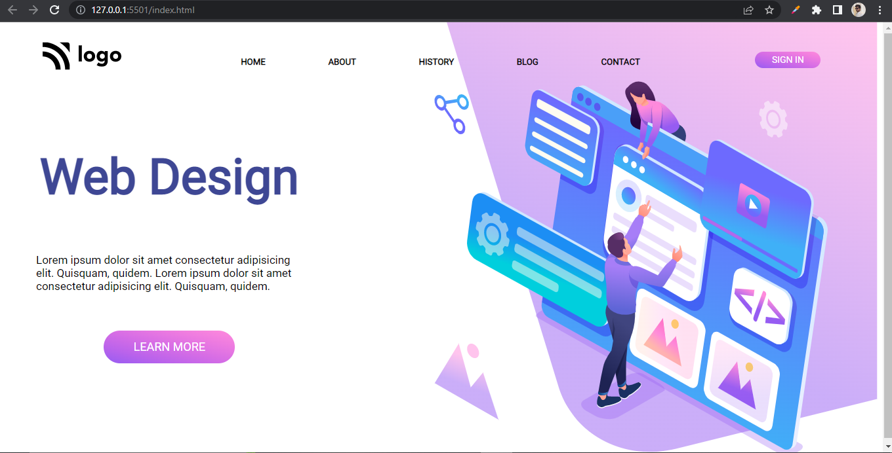

# Assignment 8

## Project 8 [Live Link](https://nachiketkeripaleproject8.netlify.app/)

-  Used flex and position in this project.
-  Used background propertys such as background-position and background-size.
-  Used Liner-gradient for background image.
-  Used Goolge Fonts for this project.

---

## Time taken to finish this project

-   4 hour to complete it.

#### Screenshot

 

